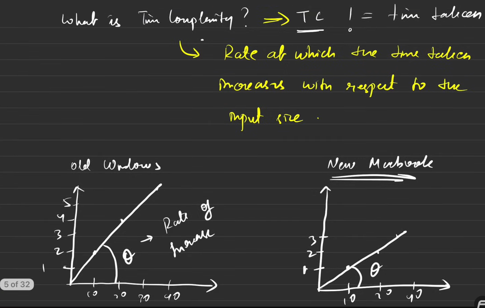
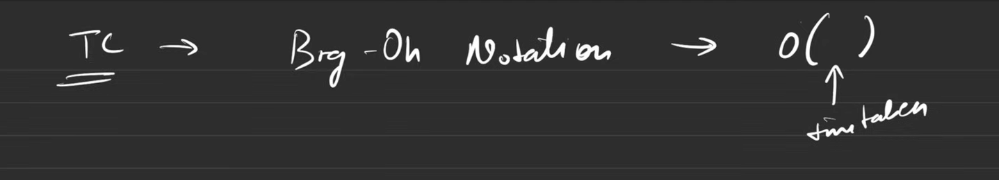
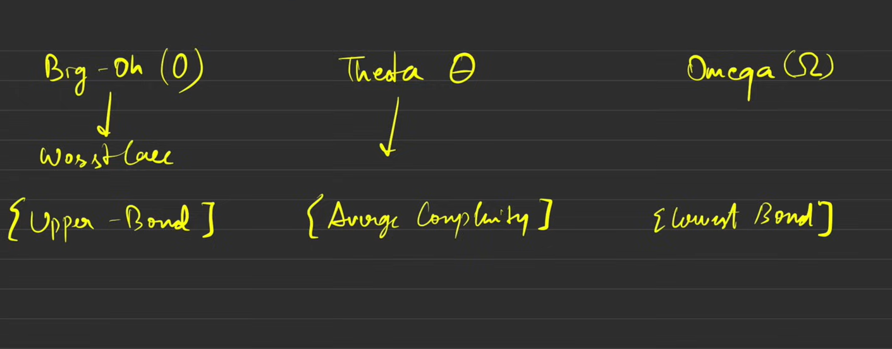
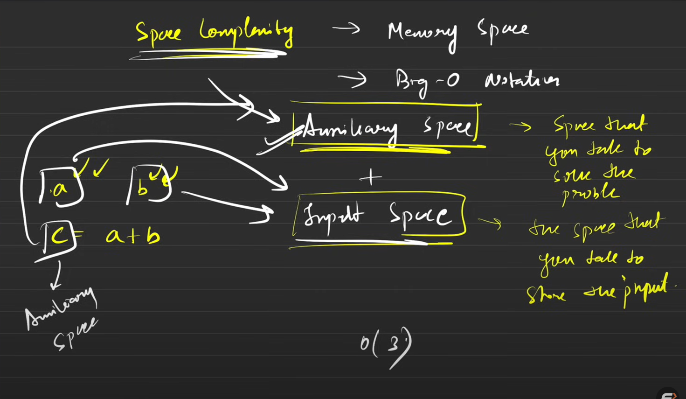
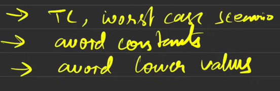
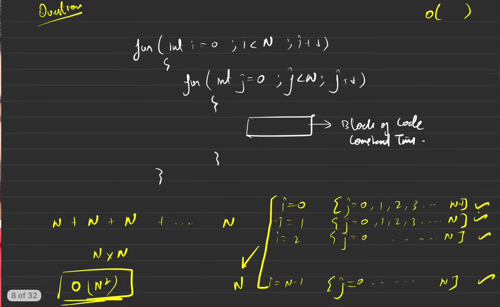
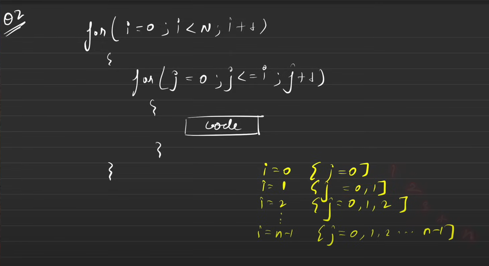
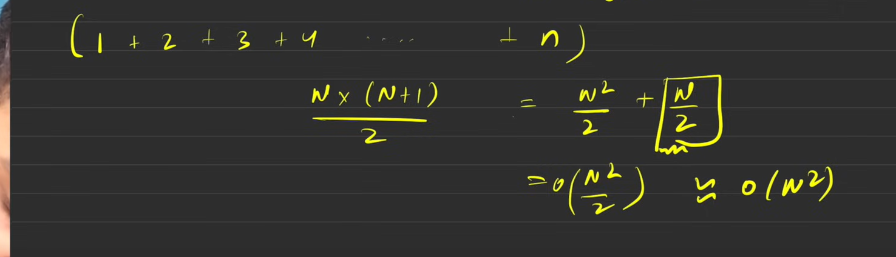

# ⏱️ Time Complexity Basics

Understanding **Time Complexity** helps us measure how the runtime of an algorithm grows with input size (**n**). It tells us *how efficient* our code is.

---

## 📘 What is Time Complexity?

Time complexity is a way to **describe how the execution time changes** with the size of the input.

> ❓Think: “How does my algorithm scale when I increase the input?”

Example:
- If you loop through `n` elements → time grows **linearly**.
- If you use nested loops → time grows **quadratically**.



---

## 🧠 Why Time Complexity Matters?

✅ Helps compare algorithms.  
✅ Predicts performance for large inputs.  
✅ Avoids slow programs that break on big data.

---

## 📈 Big O Notation (O)



We use **Big O** to describe the **upper bound** (worst-case performance).

| Notation | Name | Example | Visual |
|-----------|------|----------|--------|
| **O(1)** | Constant | Accessing an array element | ⚡ |
| **O(log n)** | Logarithmic | Binary Search | 📉 |
| **O(n)** | Linear | Simple loop | 📈 |
| **O(n log n)** | Linearithmic | Merge Sort, Quick Sort (avg) | 🔀 |
| **O(n²)** | Quadratic | Nested loops | 🌀 |
| **O(2ⁿ)** | Exponential | Recursive subsets | 💥 |
| **O(n!)** | Factorial | Permutations | 🤯 |


---

## 🧩 Visual Representation

O(1): ─────────── constant
O(log n): ╰───╯──╯───
O(n): ╰────────────╯
O(n log n): ╰──────────╯📈
O(n²): ╰─────╯📈📈
O(2ⁿ): ╰📈📈📈📈📈


🧭 **Interpretation**: As `n` increases → cost rises faster for complex functions.

---

## 🧮 Common Examples

| Code Snippet | Complexity | Reason |
|---------------|-------------|--------|
| ```js<br>for (let i = 0; i < n; i++) {}<br>``` | **O(n)** | Runs n times |
| ```js<br>for (let i = 0; i < n; i++) {<br> for (let j = 0; j < n; j++) {} }<br>``` | **O(n²)** | Nested loop |
| ```js<br>while (n > 1) { n = n/2; }<br>``` | **O(log n)** | Dividing each time |
| ```js<br>arr[5];<br>``` | **O(1)** | Direct access |

---

## ⚖️ Best, Average, Worst Case

| Case | Meaning | Example |
|------|----------|---------|
| **Best Case** | Minimum time | Sorted input in Binary Search |
| **Average Case** | Typical time | Random input |
| **Worst Case** | Maximum time | Unsorted input in Linear Search |

Usually, we consider **Worst Case** → safe estimation.

---

## 🧩 Space Complexity

It’s not just about time!  
**Space Complexity** = Extra memory used by your algorithm or **Auxiliary space** + **Input space**.

**Auxiliary Space**: Temporary space used during execution.
**Input Space**: Space taken by input data.



| Example | Space Complexity |
|----------|------------------|
| Iterative Loop | O(1) |
| Recursion (n calls) | O(n) |

---

## 🧭 Summary

| Operation | Complexity |
|------------|-------------|
| Access (Array) | O(1) |
| Search (Linear) | O(n) |
| Search (Binary) | O(log n) |
| Insert (End of Array) | O(1) |
| Insert (Middle) | O(n) |
| Sorting (Efficient) | O(n log n) |

---

## 💡 Quick Tips

✅ Avoid nested loops if possible.  
✅ Use divide and conquer (log n) where you can.  
✅ Optimize with data structures (HashMaps, Sets).  
✅ Always test with large inputs.

---
### THREE RULES

>✅ Always compute TC in terms of worst case senario.
✅ Avoid constants.  
✅ Avoid lower values.


---

## 🧭 Visual Cheat Sheet

Complexity Growth (Fast → Slow):

O(1) < O(log n) < O(n) < O(n log n) < O(n²) < O(2ⁿ) < O(n!)

---

## 🧠 Mnemonic to Remember

> **"Clever Logicians Need Logic, Not Quadratic Explosion!"**  
> *(C → Constant, L → Log n, N → n, L → n log n, NQ → n², E → 2ⁿ)*

---

## 🚀 Final Thought

Time Complexity ≠ Exact Time.  
It’s a **mathematical estimate** to compare scalability.

> “Fast code is not written, it’s analyzed!”

---

✍️ **Next Steps**:
- Practice finding time complexity of loops.
- Try analyzing sorting and searching algorithms.

---




---