# BASIC MATHS
---
## COUNTING DIGITS
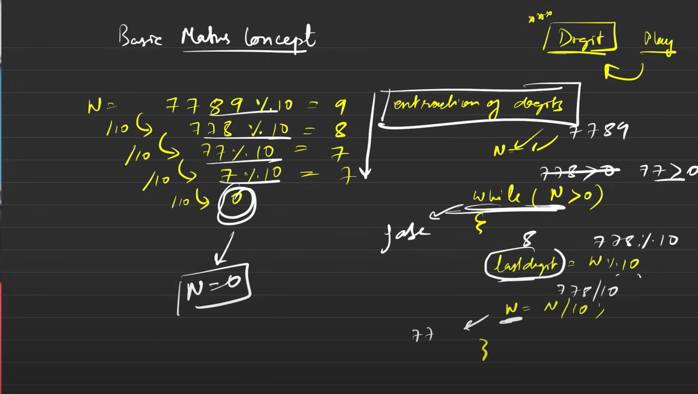

>Time Complexity: O(log10 n)
---

## REVERSE A NUMBER
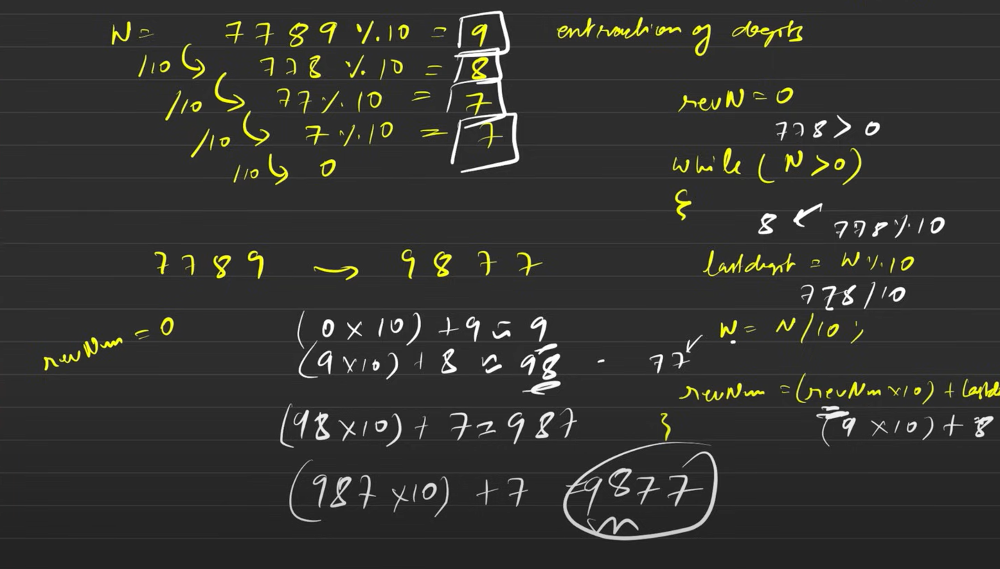
>Time Complexity: O(log10 n)
---
## CHECK PALINDROME
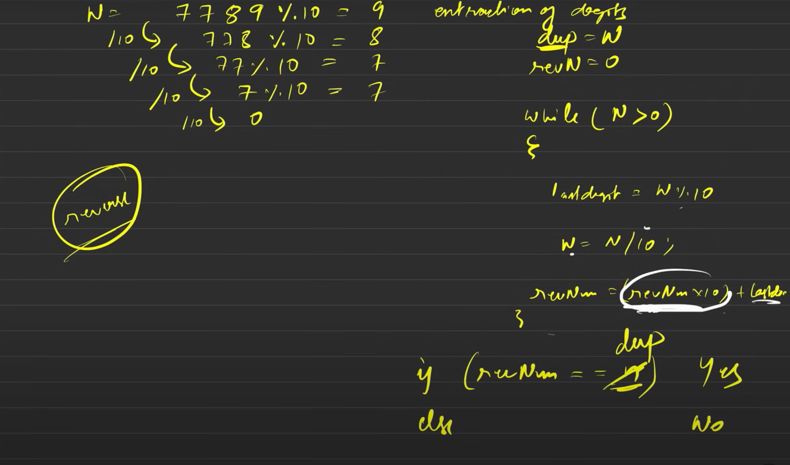
>Time Complexity: O(log10 n)
---
## ARMSTRONG NUMBER
>Time Complexity: O(d) where d is number of digits
---
## PRINT ALL DIVISORS
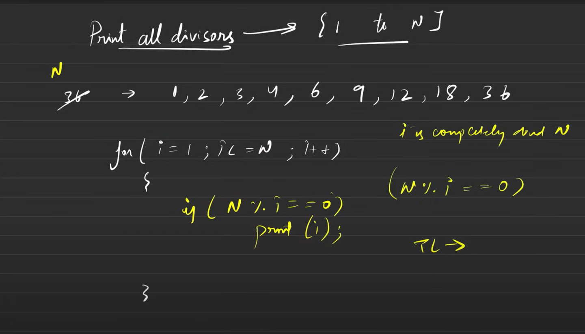
>Time Complexity: O(n)

**Mathematical Optimization:**
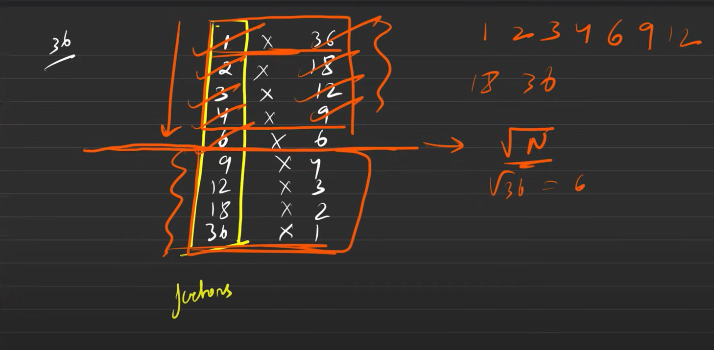
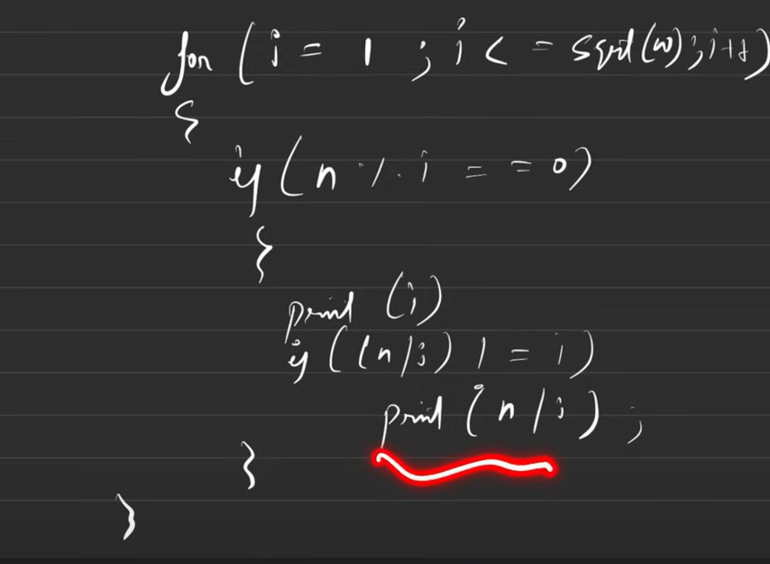

>Time Complexity: O(√n)

>**why √n?**
If n = a * b, then at least one of those numbers must be ≤ √n. If both were greater than √n, their product would exceed n. Thus, to find all divisors, we only need to check up to √n.
Then, for each divisor i found, we can also include n/i as a corresponding divisor.
Then, sort the list of divisors to get them in ascending order.
---
## Prime Number
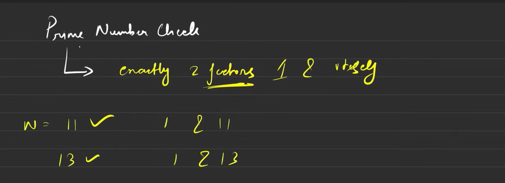

**Brute Force Approach**
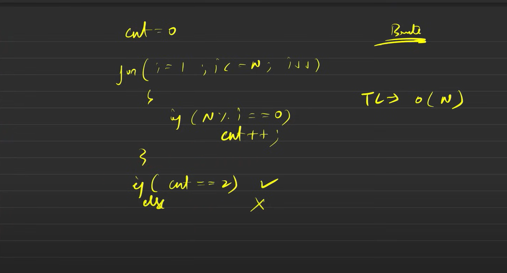
>Time Complexity: O(n)

**Optimized Approach**
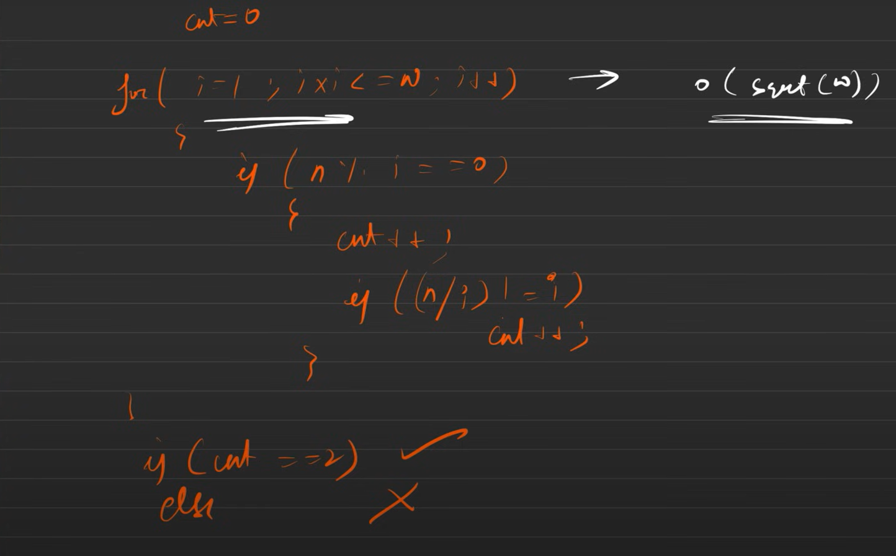

>Time Complexity: O(√n)
---
## GCD & HCF
GCD - Greatest Common Divisor - The largest positive integer that divides two or more integers without leaving a remainder.
HCF - Highest Common Factor - Another term for GCD, representing the largest factor shared by two or more integers.

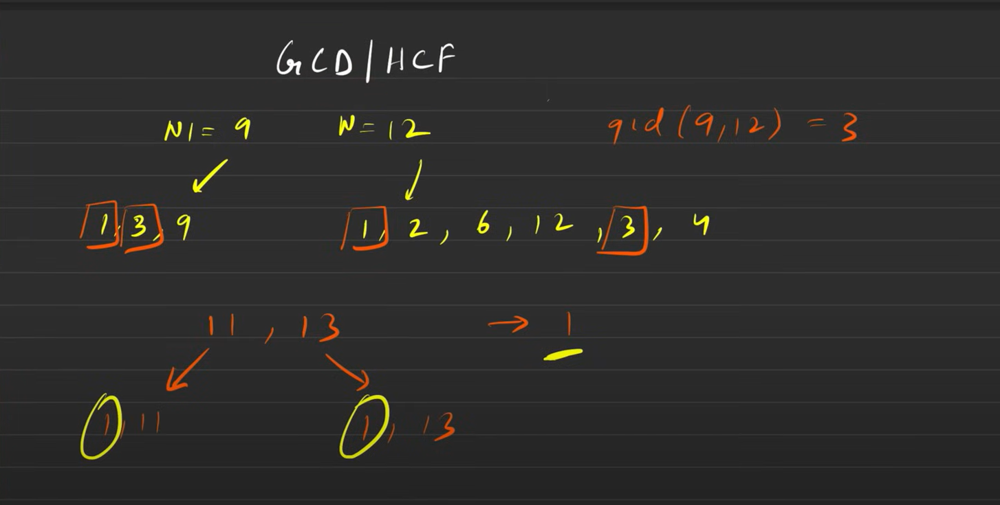

**Brute Force Approach**
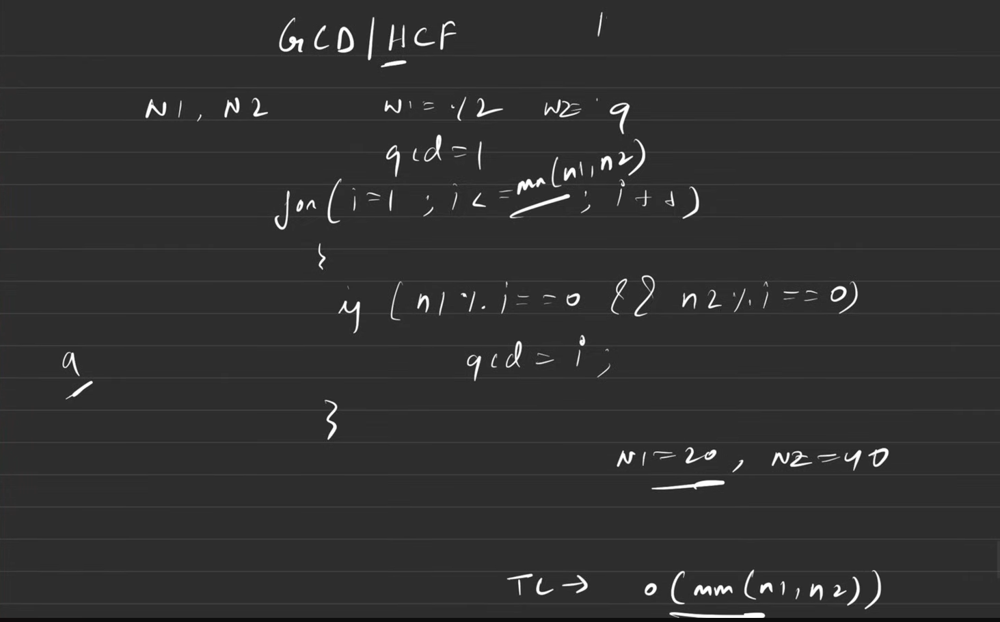
>Time Complexity: O(min(a, b))

**Optimized Approach**
Works well in some cases but not all.
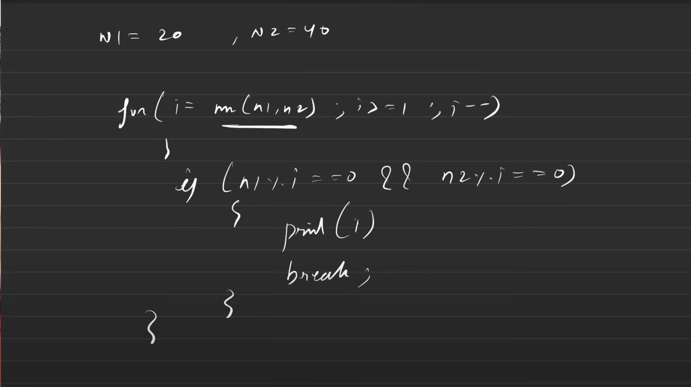
>Time Complexity: O(min(a, b))

**Euclidean Algorithm**
>GCD(a, b) = GCD(b, a % b)
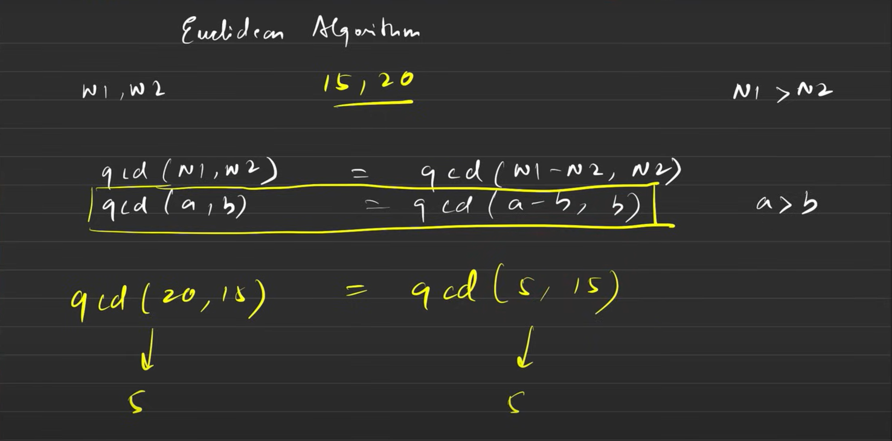
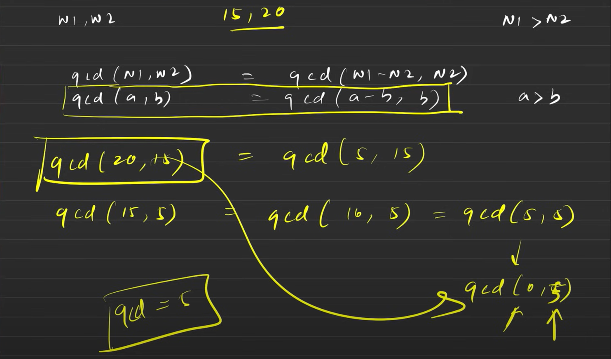
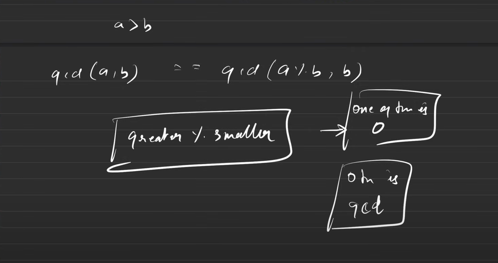
>Time Complexity: O(log(min(a, b)))
---
