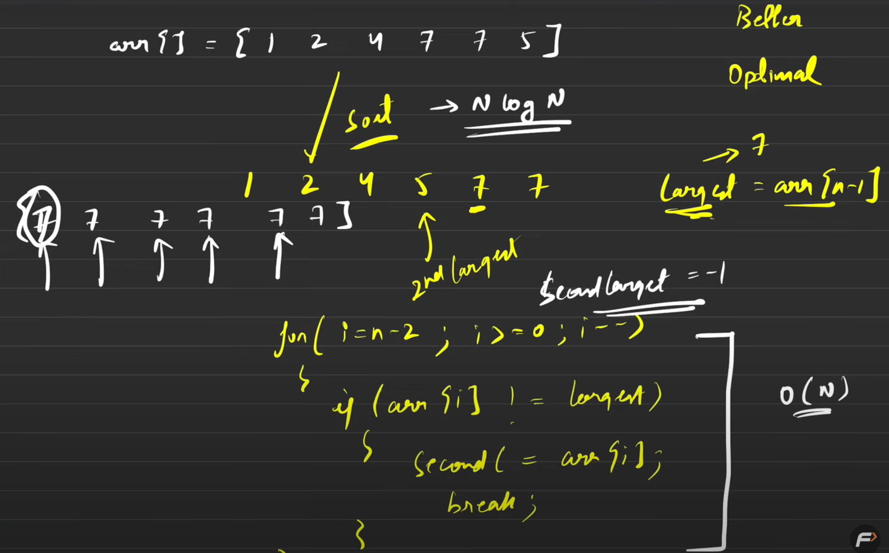
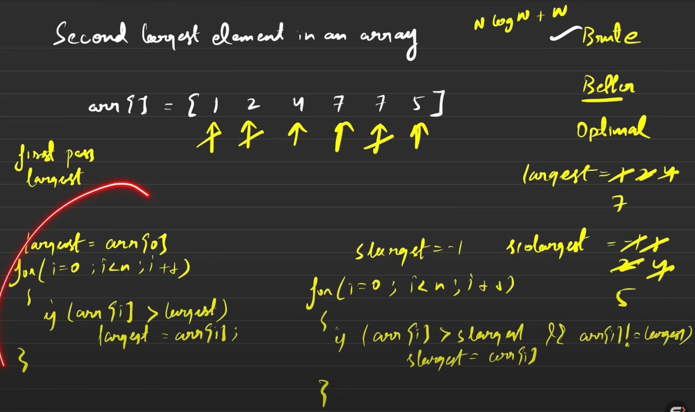
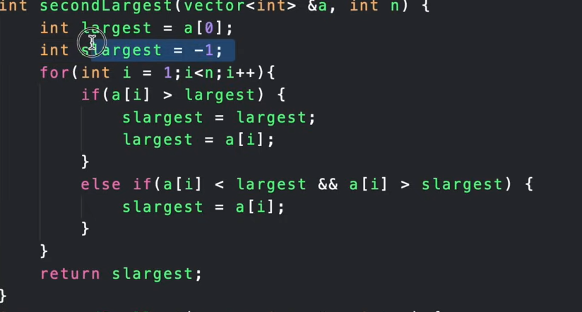

# Array - Easy

## Largest Element in an Array

>Time Complexity: O(n)
---
## Second Largest Element in an Array

###  Approach 1: Sort the array and return the second last element

>Time Complexity: O(nlogn)

### Approach 2: Traverse the array and keep track of the largest and second largest element

>Time Complexity: O(2n)

### Approach 3: Traverse the array and keep track of the largest and second largest element in a single traversal

>Time Complexity: O(n)

